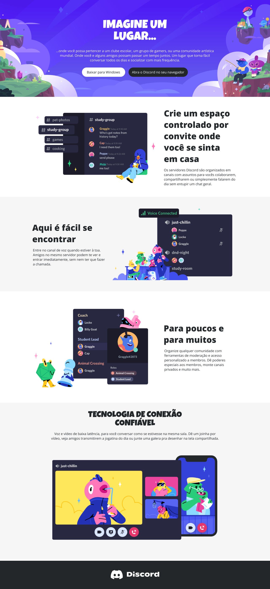

# Desafio 4: Reproduzindo a página da plataforma do Discord com a Responsividade do CSS

Neste Desafio foi reproduzido a página da plataforma do Discord, utilizando os conhecimentos de responsividade no CSS aprendidos ao longo da segunda parte da formação CSS da DIO.

## Designi para o Desktop:

## Designi para dispositivos móveis:
